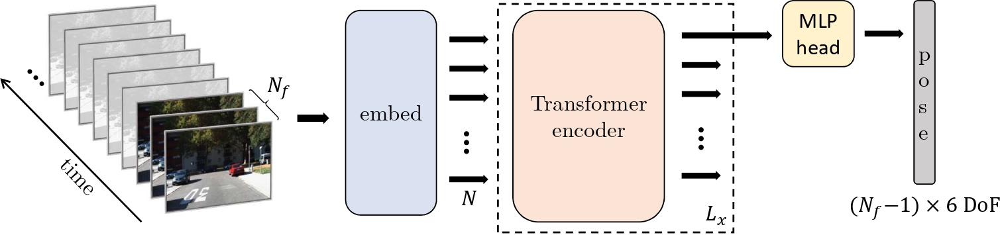

# TSformer-VO: an end-to-end Transformer-based model for monocular visual odometry

[](https://ieeexplore.ieee.org/document/10845764)
[](https://arxiv.org/abs/2305.06121)
[](https://github.com/aofrancani/TSformer-VO/blob/main/LICENSE)

Official repository of "[Transformer-Based Model for Monocular Visual Odometry: A Video Understanding Approach](https://ieeexplore.ieee.org/document/10845764)"

## Abstract
*Estimating the camera’s pose given images from a single camera is a traditional task in mobile robots and autonomous vehicles. This problem is called monocular visual odometry and often relies on geometric approaches that require considerable engineering effort for a specific scenario. Deep learning methods have been shown to be generalizable after proper training and with a large amount of available data. Transformer-based architectures have dominated the state-of-the-art in natural language processing and computer vision tasks, such as image and video understanding. In this work, we deal with the monocular visual odometry as a video understanding task to estimate the 6 degrees of freedom of a camera’s pose. We contribute by presenting the TSformer-VO model based on spatio-temporal self-attention mechanisms to extract features from clips and estimate the motions in an end-to-end manner. Our approach achieved competitive state-of-the-art performance compared with geometry-based and deep learning-based methods on the KITTI visual odometry dataset, outperforming the DeepVO implementation highly accepted in the visual odometry community.*



## Contents
1. [Dataset](#1-dataset)
2. [Pre-trained models](#2-pre-trained-models)
3. [Setup](#3-setup)
4. [Usage](#4-usage)
5. [Evaluation](#5-evaluation)


## 1. Dataset
Download the [KITTI odometry dataset (grayscale).](https://www.cvlibs.net/datasets/kitti/eval_odometry.php)

In this work, we use the `.jpg` format. You can convert the dataset to `.jpg` format with [png_to_jpg.py.](https://github.com/aofrancani/DPT-VO/blob/main/util/png_to_jpg.py)

Create a simbolic link (Windows) or a softlink (Linux) to the dataset in the `dataset` folder:

- On Windows:
```mklink /D <path_to_your_project>\TSformer-VO\data <path_to_your_downloaded_data>```
- On Linux: 
```ln -s <path_to_your_downloaded_data> <path_to_your_project>/TSformer-VO/data```

The data structure should be as follows:
```
|---TSformer-VO
    |---data
        |---sequences_jpg
            |---00
                |---image_0
                    |---000000.png
                    |---000001.png
                    |---...
                |---image_1
                    |...
                |---image_2
                    |---...
                |---image_3
                    |---...
            |---01
            |---...
		|---poses
			|---00.txt
			|---01.txt
			|---...
```

## 2. Pre-trained models

Here you find the checkpoints of our trained-models. The architectures vary according to the number of frames (Nf) in the input clip, which also influences the last MLP head.

**Google Drive folder**: [link to checkpoints in GDrive](https://drive.google.com/drive/folders/124Z8aCPtPVH4bsUR78NYaK4m6SLna2Kf?usp=share_link)

| Model | Nf | Checkpoint (.pth) | Args (Model Parameters)|
| --- | --- | --- | --- |
| TSformer-VO-1 | 2 | [checkpoint_model1](https://drive.google.com/file/d/1p9tgK9hTwgC6-xRDtLecNJ8VYH0l5_aa/view?usp=sharing) | [args.pkl](https://drive.google.com/file/d/1qmD6pAmjYRqKNMs_3VQliFdqKjsN0YW9/view?usp=sharing) |
| TSformer-VO-2 | 3 | [checkpoint_model2](https://drive.google.com/file/d/1ZnPvEf-fGpRoFcywaH2JVmaHjLgRa8Ez/view?usp=share_link) | [args.pkl](https://drive.google.com/file/d/1Ua-mCTYPzUoiyS5jadfm7TGz6zGKBevy/view?usp=share_link) |
| TSformer-VO-3 | 4 | [checkpoint_model3](https://drive.google.com/file/d/1lYvLEXN5zWQy1dW5p6hEXdEOVH58JcoD/view?usp=sharing) | [args.pkl](https://drive.google.com/file/d/1kp-0R7v2pVRTNpxFXPG7DgBHLr7M2ct-/view?usp=share_link) |

## 3. Setup
- Create a virtual environment using Anaconda and activate it:
```
conda create -n tsformer-vo python==3.8.0
conda activate tsformer-vo
```
- Install dependencies (with environment activated):
```
pip install -r requirements.txt
```

## 4. Usage

**PS**: So far we are changing the settings and hyperparameters directly in the variables and dictionaries. As further work, we will use pre-set configurations with the `argparse` module to make a user-friendly interface.

### 4.1. Training

In `train.py`:
- Manually set configuration in `args` (python dict);
- Manually set the model hyperparameters in `model_params` (python dict);
- Save and run the code `train.py`.

### 4.2. Inference

In `predict_poses.py`:
- Manually set the variables to read the checkpoint and sequences.

| **Variables**   | **Info**                                                                                                             |
|-----------------|----------------------------------------------------------------------------------------------------------------------|
| checkpoint_path | String with the path to the trained model you want to use for inference.  Ex: checkpoint_path = "checkpoints/Model1" |
| checkpoint_name | String with the name of the desired checkpoint (name of the .pth file).  Ex: checkpoint_name = "checkpoint_model2_exp19" |
| sequences       | List with strings representing the KITTI sequences.  Ex: sequences = ["03", "04", "10"]                              |

### 4.3. Visualize Trajectories
In `plot_results.py`:
- Manually set the variables to the checkpoint and desired sequences, similarly to [Inference](#42-inference)


## 5. Evaluation
The evaluation is done with the [KITTI odometry evaluation toolbox](https://github.com/Huangying-Zhan/kitti-odom-eval). Please go to the [evaluation repository](https://github.com/Huangying-Zhan/kitti-odom-eval) to see more details about the evaluation metrics and how to run the toolbox.


## Citation
Please cite our paper you find this research useful in your work:

```bibtex
@article{Francani2025,
  author={Françani, André O. and Maximo, Marcos R. O. A.},
  journal={IEEE Access}, 
  title={Transformer-Based Model for Monocular Visual Odometry: A Video Understanding Approach}, 
  year={2025},
  volume={13},
  number={},
  pages={13959-13971},
  doi={10.1109/ACCESS.2025.3531667}
}
```

## References

Code adapted from [TimeSformer](https://github.com/facebookresearch/TimeSformer). 

Check out our previous work on monocular visual odometry: [DPT-VO](https://github.com/aofrancani/DPT-VO)

 
